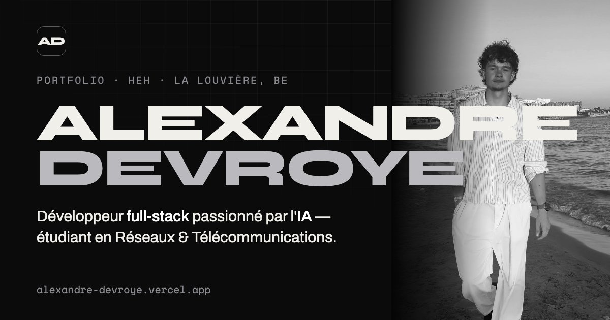

# Alexandre Devroye — Portfolio

[](https://alexandre-devroye.vercel.app)


[](https://alexandre-devroye.vercel.app)

Mon portfolio personnel : mon parcours, mes projets, ma stack et mes activités en dehors du code.

Je suis étudiant en **bachelier Réseaux & Télécommunications à la HEH** (La Louvière, Belgique) et développeur full-stack, passionné par l'**intelligence artificielle**.

👉 **[alexandre-devroye.vercel.app](https://alexandre-devroye.vercel.app)**

---

## Sommaire

- [Fonctionnalités](#fonctionnalités)
- [Stack technique](#stack-technique)
- [Structure du projet](#structure-du-projet)
- [Lancer le projet en local](#lancer-le-projet-en-local)
- [Déploiement](#déploiement)
- [Performance & SEO](#performance--seo)
- [Contact](#contact)

## Fonctionnalités

- **Hero animé** : un champ de particules dessiné sur `<canvas>`, qui réagit à la souris.
- **Thème clair / sombre** : il suit le réglage du système, se change d'un clic, et le choix est mémorisé.
- **Parcours** : une timeline qui s'anime quand on arrive dessus en faisant défiler la page.
- **Index des projets** : un accordéon avec, pour chaque projet, sa composition technique et un aperçu.
- **Stack** : une grille avec les logos officiels des technologies.
- **Responsive** : testé de 320 px (petit mobile) à 1440 px (ordinateur).
- **Accessibilité** : navigation au clavier, `aria-*`, et prise en compte de `prefers-reduced-motion`, qui coupe les animations pour les personnes qui le demandent.

## Stack technique

| Domaine | Choix |
|---|---|
| Structure | HTML5 sémantique |
| Style | CSS natif : variables, `clamp()`, container queries, `color-mix()` |
| Interactions | JavaScript vanilla, sans framework |
| Animations | Canvas 2D, `IntersectionObserver`, transitions CSS |
| Typographies | Syne, Archivo, Space Mono (Google Fonts) |
| Hébergement | Vercel |

Le site n'a **aucune dépendance et aucune étape de build** : un seul fichier `index.html` et des images.

## Structure du projet

```
portfolio/
├── index.html             # Tout le site : HTML, CSS et JS
├── about-alex.webp/.jpg   # Photos (WebP + JPG de secours)
├── alex-karate.webp/.jpg
├── *-logo.png             # Logos des écoles et entreprises (timeline)
├── og-image.jpg           # Image d'aperçu pour les réseaux sociaux (1200×630)
├── favicon.svg            # Icône de l'onglet
├── apple-touch-icon.png   # Icône pour l'écran d'accueil iOS
├── robots.txt             # Règles pour les moteurs de recherche
└── sitemap.xml            # Plan du site pour Google
```

## Lancer le projet en local

Il n'y a rien à installer. Clone le dépôt, puis lance un petit serveur local :

```bash
git clone https://github.com/XELAEYORVED/portfolio.git
cd portfolio

# au choix :
npx serve .            # avec Node.js
python3 -m http.server # avec Python
```

Ouvre ensuite l'adresse affichée dans le terminal. Avec VS Code, l'extension **Live Server** fonctionne aussi.

## Déploiement

Le site est hébergé sur **Vercel** et se déploie tout seul :

- chaque push sur `main` met à jour la **production** ;
- chaque Pull Request reçoit une **URL d'aperçu**, pour vérifier les changements avant de les fusionner.

## Performance & SEO

**Performance**
- Images en **WebP** (−35 à −50 % de poids), chargées en différé (`loading="lazy"`).
- Animations calculées par la carte graphique (`transform`) plutôt que redessinées en continu.
- Parallax et particules en pause quand ils ne sont pas visibles.

**SEO**
- Balises `title`, `description` et `canonical` optimisées.
- **Open Graph / Twitter Cards**, pour un aperçu soigné sur LinkedIn, WhatsApp et Discord.
- **Données structurées JSON-LD** (`ProfilePage` / `Person`).
- `robots.txt` et `sitemap.xml`, avec le site validé dans Google Search Console.

## Contact

- 💼 [LinkedIn](https://www.linkedin.com/in/alexandre-devroye-5b145624b/)
- 🐙 [GitHub](https://github.com/XELAEYORVED)
- ▶️ [YouTube — Alex Way](https://www.youtube.com/@alexdevway)
- ✉️ [alexandre.devroye@std.heh.be](mailto:alexandre.devroye@std.heh.be)

---

© 2026 Alexandre Devroye. Le code est consultable, mais les photos et les contenus personnels restent ma propriété.
